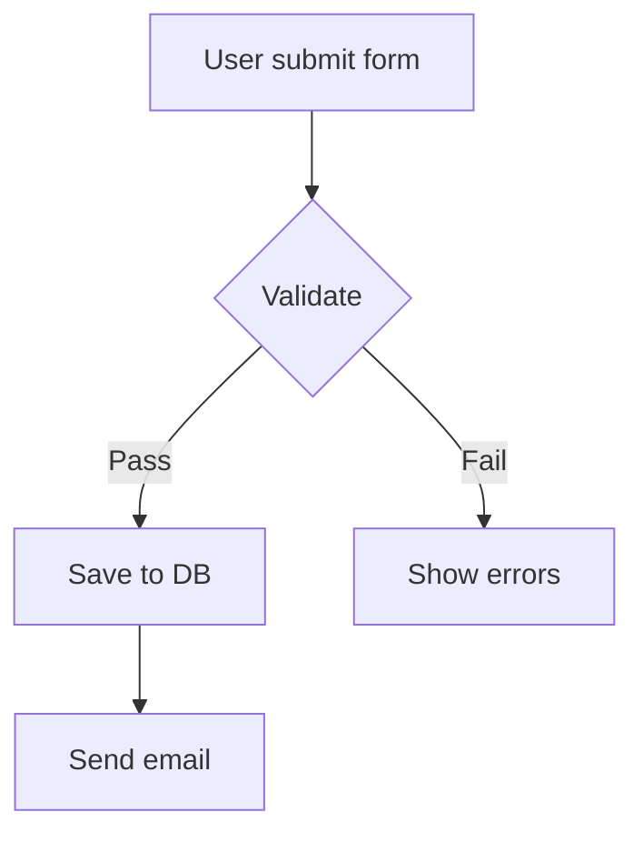
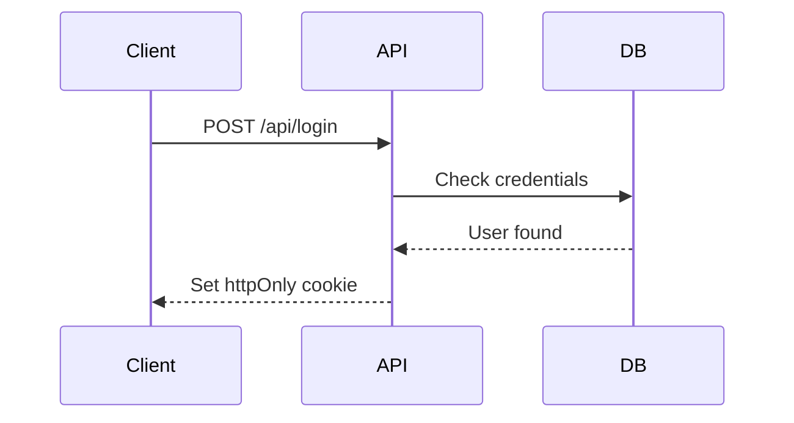
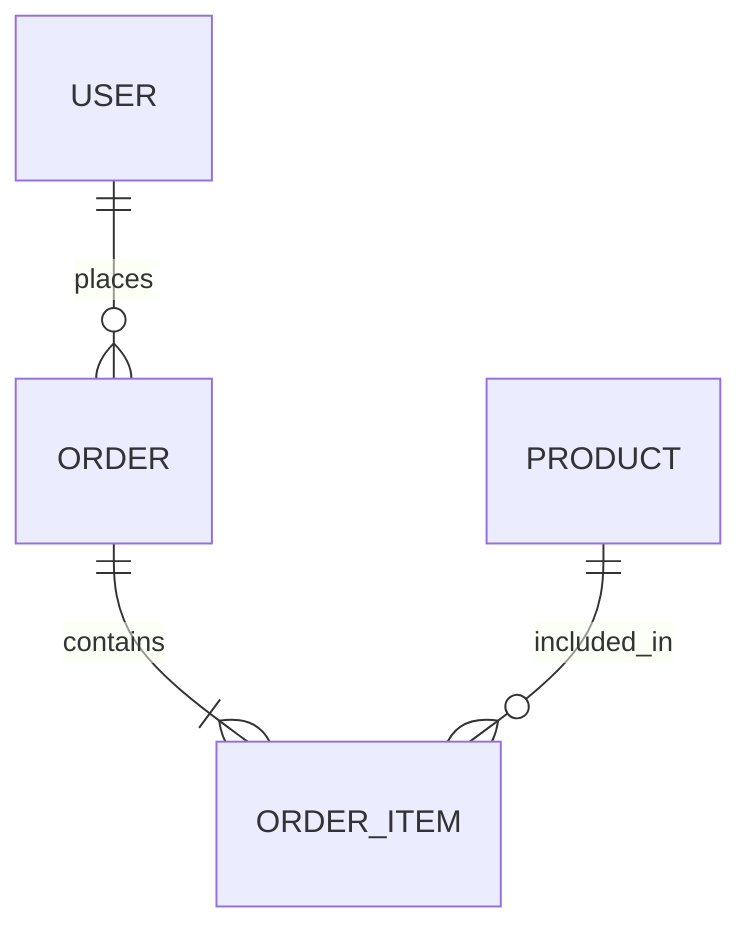

# Data Visualization

## Khi nào cần đọc skill này
- Cần vẽ diagram/flowchart/ER/sequence diagram
- Cần data chart (bar, line, pie) export ra PNG/SVG để nhúng vào docx/pdf
- Cần chart hiển thị trên web (dashboard, analytics)
- Không biết dùng tool nào

---

## Phân tích — Chọn Tool

| Tình huống | Tool | Output |
|-----------|------|--------|
| Flowchart, sequence, ER, Gantt, mindmap | **Mermaid** | PNG/SVG/HTML |
| UML phức tạp (class, component) | **PlantUML** | PNG/SVG |
| Data chart trong Python script | **Matplotlib** | PNG/SVG/PDF |
| Data chart interactive + export | **Plotly** | PNG + HTML |
| Data chart trong Node.js script | **Chart.js + canvas** | PNG |
| Chart hiển thị trực tiếp trên web | **Recharts** | React component |

**Quyết định nhanh:**
```
Output là file (nhúng vào docx/pdf)?    → Mermaid / Matplotlib / Plotly
Output là web UI?                        → Recharts
Diagram logic/flow?                      → Mermaid (code-first, version control được)
Data từ DataFrame/CSV?                   → Matplotlib hoặc Plotly
```

---

## Design — Mermaid (Diagrams)

Mermaid là text-based → commit được vào git, render trực tiếp trên GitHub/GitLab.

```bash
npm install -g @mermaid-js/mermaid-cli
# hoặc dùng API không cần install: https://mermaid.ink
```

**Flowchart:**


**Sequence diagram:**


**ER diagram:**


**Export ra file:**
```bash
mmdc -i diagram.mmd -o output.png -t default -b white
mmdc -i diagram.mmd -o output.svg
```

**Mermaid qua API (không cần install):**
```python
import httpx, base64

diagram = "flowchart TD\n  A-->B"
encoded = base64.urlsafe_b64encode(diagram.encode()).decode()
url = f"https://mermaid.ink/img/{encoded}"
# GET url → trả về PNG
```

---

## Design — Matplotlib (Python Data Charts)

```python
import matplotlib.pyplot as plt
import matplotlib
matplotlib.use('Agg')  # non-interactive backend — bắt buộc khi không có display

fig, ax = plt.subplots(figsize=(10, 6))

# Bar chart
categories = ['Q1', 'Q2', 'Q3', 'Q4']
values = [120, 180, 150, 220]
bars = ax.bar(categories, values, color='#1677ff', alpha=0.8)

ax.set_title('Doanh thu theo quý', fontsize=16, fontweight='bold')
ax.set_ylabel('Triệu đồng')
ax.set_ylim(0, max(values) * 1.2)

# Value labels trên cột
for bar, val in zip(bars, values):
    ax.text(bar.get_x() + bar.get_width()/2, bar.get_height() + 2,
            f'{val}M', ha='center', va='bottom')

plt.tight_layout()
plt.savefig('chart.png', dpi=150, bbox_inches='tight')
plt.close()
```

---

## Design — Plotly (Interactive + Export)

```python
import plotly.graph_objects as go

fig = go.Figure()
fig.add_trace(go.Bar(
    x=['Q1', 'Q2', 'Q3', 'Q4'],
    y=[120, 180, 150, 220],
    marker_color='#1677ff'
))
fig.update_layout(title='Doanh thu theo quý', yaxis_title='Triệu đồng')

# Export
fig.write_image('chart.png')   # cần: pip install kaleido
fig.write_html('chart.html')   # interactive
fig.write_image('chart.svg')
```

---

## Design — Recharts (Web UI only)

```tsx
'use client'
import { ResponsiveContainer, BarChart, Bar, XAxis, YAxis, Tooltip } from 'recharts'

const data = [{ name: 'Q1', value: 120 }, { name: 'Q2', value: 180 }]

export function RevenueChart() {
  return (
    <ResponsiveContainer width="100%" height={300}>
      <BarChart data={data}>
        <XAxis dataKey="name" />
        <YAxis />
        <Tooltip />
        <Bar dataKey="value" fill="#1677ff" />
      </BarChart>
    </ResponsiveContainer>
  )
}
```

---

## Common Mistakes

| Sai | Đúng |
|-----|------|
| Dùng Recharts để export ra file | Recharts chỉ render web. Dùng Matplotlib/Plotly để export |
| Matplotlib crash "no display" | Thêm `matplotlib.use('Agg')` trước import pyplot |
| Mermaid syntax lỗi không rõ nguyên nhân | Paste vào mermaid.live để debug trực tiếp |
| Hardcode màu hex trong chart | Dùng palette nhất quán, define constant màu |
| Chart không có title/label | Luôn có title + axis labels + unit |
| Nhồi quá nhiều series | Max 5 series / chart, chia nhiều chart nếu cần |
