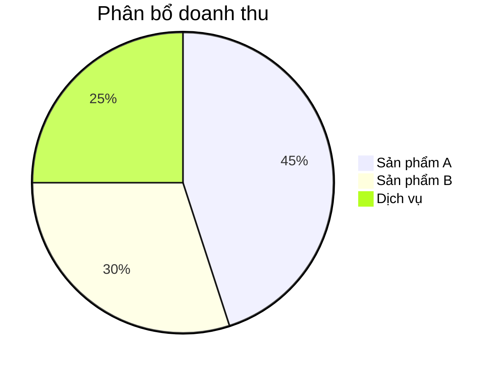

# Presentation Generation

## Khi nào cần đọc skill này
- Output là file `.pptx` hoặc slide deck
- Cần tạo presentation từ data (report, summary, demo)
- Cần slide từ Markdown nhanh
- Cần nhúng chart vào slide

---

## Phân tích — Chọn Tool

| Tình huống | Tool | Stack |
|-----------|------|-------|
| `.pptx` từ data/template — Python | **python-pptx** | Python |
| `.pptx` từ Node.js | **PptxGenJS** | Node.js |
| Slide nhanh từ Markdown (technical) | **Marp** | CLI |
| Slide web có animation/code highlight | **Reveal.js** | HTML/JS |
| Slide từ Mermaid diagram | Marp + Mermaid | Markdown |

**Quyết định nhanh:**
```
Client cần file .pptx editable?    → python-pptx hoặc PptxGenJS
Dev/tech presentation nhanh?       → Marp (Markdown → PDF/PPTX/HTML)
Cần nhúng chart từ data?           → python-pptx + Matplotlib
Cần animate / web hosted?          → Reveal.js
```

---

## Design — python-pptx

```python
from pptx import Presentation
from pptx.util import Inches, Pt, Emu
from pptx.dml.color import RGBColor
from pptx.enum.text import PP_ALIGN

prs = Presentation()
prs.slide_width  = Inches(13.33)   # 16:9 widescreen
prs.slide_height = Inches(7.5)

# Slide 1: Title
slide = prs.slides.add_slide(prs.slide_layouts[0])
slide.shapes.title.text = "Báo cáo Q1 2026"
slide.placeholders[1].text = "Prepared by: Team A"

# Slide 2: Content + bullets
slide = prs.slides.add_slide(prs.slide_layouts[1])
slide.shapes.title.text = "Highlights"
tf = slide.placeholders[1].text_frame
tf.text = "Doanh thu tăng 25% so với Q4"
p = tf.add_paragraph()
p.text = "Khách hàng mới: 120 (+40%)"
p.level = 1  # indent level

# Slide 3: Nhúng chart (PNG từ Matplotlib)
slide = prs.slides.add_slide(prs.slide_layouts[6])  # blank
slide.shapes.add_picture('chart.png', Inches(1), Inches(1.5), Inches(11), Inches(5))
slide.shapes.title = None  # blank layout không có title placeholder

# Slide 4: Chart native pptx (editable trong PowerPoint)
from pptx.chart.data import ChartData
from pptx.enum.chart import XL_CHART_TYPE

chart_data = ChartData()
chart_data.categories = ['Q1', 'Q2', 'Q3', 'Q4']
chart_data.add_series('Doanh thu (M)', (120, 180, 150, 220))
slide = prs.slides.add_slide(prs.slide_layouts[6])
slide.shapes.add_chart(
    XL_CHART_TYPE.COLUMN_CLUSTERED,
    Inches(1), Inches(1), Inches(11), Inches(5.5),
    chart_data
)

prs.save('presentation.pptx')
```

---

## Design — PptxGenJS (Node.js)

```typescript
import pptxgen from 'pptxgenjs'

const pres = new pptxgen()
pres.layout = 'LAYOUT_WIDE'  // 16:9

// Slide 1: Title
const slide1 = pres.addSlide()
slide1.addText('Báo cáo Q1 2026', {
  x: 1, y: 2.5, w: '80%', h: 1.5,
  fontSize: 40, bold: true, color: '1677ff', align: 'center'
})

// Slide 2: Bullets
const slide2 = pres.addSlide()
slide2.addText([
  { text: 'Highlights', options: { fontSize: 28, bold: true, breakLine: true } },
  { text: 'Doanh thu tăng 25%', options: { fontSize: 18, bullet: true } },
  { text: 'Khách hàng mới: 120', options: { fontSize: 18, bullet: { indent: 30 } } },
], { x: 0.5, y: 0.5, w: '95%', h: '90%' })

// Slide 3: Nhúng chart PNG
const slide3 = pres.addSlide()
slide3.addImage({ path: 'chart.png', x: 0.5, y: 1, w: 12, h: 5.5 })

// Slide 4: Table
const slide4 = pres.addSlide()
slide4.addTable(
  [
    [{ text: 'Sản phẩm', options: { bold: true, fill: '1677ff', color: 'ffffff' } },
     { text: 'Doanh thu', options: { bold: true, fill: '1677ff', color: 'ffffff' } }],
    ['Sản phẩm A', '1,200,000đ'],
    ['Sản phẩm B', '800,000đ'],
  ],
  { x: 0.5, y: 1, w: 12, colW: [6, 6], border: { pt: 1, color: 'dddddd' } }
)

await pres.writeFile({ fileName: 'presentation.pptx' })
```

---

## Design — Marp (Markdown → Slides)

Nhanh nhất cho technical presentation, version control được.

```bash
npm install -g @marp-team/marp-cli
```

```markdown
---
marp: true
theme: default
paginate: true
backgroundColor: #fff
---

# Báo cáo Q1 2026
**Team A** | 29/03/2026

---

## Highlights

- Doanh thu tăng **25%** so với Q4
- Khách hàng mới: **120** (+40%)
- NPS score: **72** (target: 70)

---

## Revenue Chart


---

## Mermaid Diagram


```

```bash
marp slides.md --pdf    # Export PDF
marp slides.md --pptx   # Export PPTX
marp slides.md          # Export HTML
marp --watch slides.md  # Live preview
```

---

## Implementation Rules

- Nhúng chart: generate PNG (150-300 DPI) trước, sau đó embed — không SVG.
- python-pptx: layout index 6 = blank slide (tốt nhất cho full-bleed image/chart).
- Marp: dùng `mermaid` code block cho diagram trực tiếp trong slide.
- File output nên có timestamp: `report_Q1_2026.pptx`.

---

## Common Mistakes

| Sai | Đúng |
|-----|------|
| Nhúng SVG trực tiếp vào slide | Convert sang PNG trước |
| Slide chứa quá nhiều text | Max 5-6 bullet points / slide |
| python-pptx: hardcode pixel position | Dùng `Inches()` cho position/size |
| Marp không có theme | Thêm `theme: default` vào frontmatter |
| Quên `pres.layout = 'LAYOUT_WIDE'` | Set 16:9 từ đầu, không phải 4:3 |
