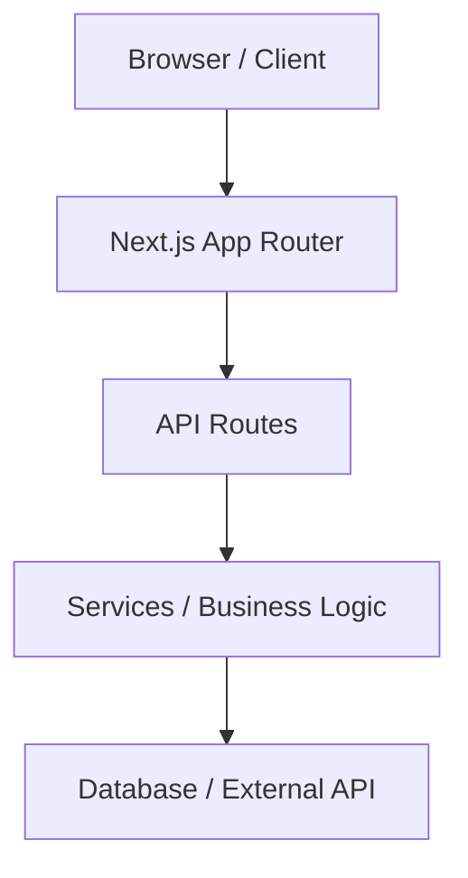

# Architecture: {Solution Name}
<!-- Auto-generated bởi /analyze PHASE 3. Cập nhật khi có thay đổi kiến trúc lớn. -->

## Solution Type
<!-- Web App | CLI | API | Automation | Extension | Desktop | Mobile | Script | Process -->

## Overview
<!-- 2-3 câu mô tả kiến trúc tổng thể -->

## Layer Diagram



## Component Breakdown

| Component | Responsibility | Location |
|-----------|---------------|----------|
| <!-- tên component --> | <!-- làm gì --> | <!-- path --> |

## Data Flow
<!-- Mô tả luồng dữ liệu chính: request → xử lý → response -->

```
[Input] → [Step 1] → [Step 2] → [Output]
```

## Key Design Decisions
<!-- Những quyết định kiến trúc quan trọng + lý do -->
<!-- Quyết định tự do Claude đưa ra → ghi vào context/decisions.md thay -->

| Decision | Chosen | Alternatives Considered | Reason |
|----------|--------|------------------------|--------|
| | | | |

## External Dependencies
<!-- Services, APIs, databases bên ngoài cần thiết -->

| Service | Purpose | Required / Optional |
|---------|---------|---------------------|
| | | |

## Scalability Notes
<!-- Những điểm cần chú ý khi scale, hiện tại có thể bỏ qua -->
